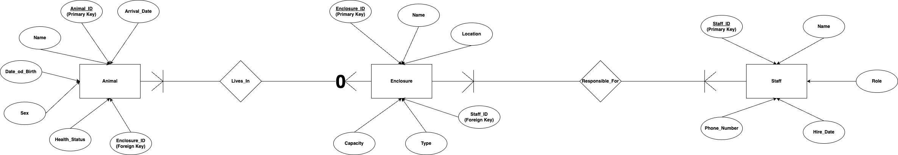

# HW4
HW 4
(Due 2/17)
Part 1 (50 points): Normalization and Standardization 
Take the iris data set and create two new .csv data sets (25 points each). One that normalizes all columns to have values between 0 and 1 and a second that standardizes all columns to have a mean of 0 and standard deviation of 1.
Push both files to github. 

Part 2 (50 points): ER Diagram 
Create an ER diagram that models a zoo:
Define at least three entities that have several attributes for each entity, their relationship between entities, and their constraints. Argue your decisions. You will graded based on your explanation on why you chose certain constraints. 
What to submit 
Either create a markdown readme file that has a copy of your ER diagram and explanation or .pdf version and push that to github.
Please also submit a link to your github submission to Canvas as well. This helps the TA grade faster. 

# **Part 1**
- The processed data `normalized_iris_data.csv` and `standardized_iris_data.csv` are stored in the data directory by running the 1.py script.

# **Part 2: Zoo ER Diagram Explanation**

My **Entity-Relationship (ER) Diagram** models a **Zoo Management System**, defining key **entities, attributes, relationships, and constraints** to ensure the system's data integrity. Below is a detailed explanation of the three core **entities**, their **attributes**, **relationships**, and a justification of the design choices.

---

## **1. Entities and Their Attributes**

### **1.1 Animal Entity**
This entity represents animals housed in the zoo.

#### **Attributes:**
- **`Animal_ID (PK)`** → Unique identifier for each animal.
- **`Name`** → The given or commonly known name of the animal.
- **`Date_of_Birth`** → The animal's birth date (optional, as some wild-captured animals may have an estimated birth date).
- **`Sex`** → The gender of the animal (Male/Female).
- **`Health_Status`** → Current health condition (e.g., Healthy, Sick, Under Treatment).
- **`Arrival_Date`** → The date when the animal arrived at the zoo.
- **`Enclosure_ID (FK)`** → References the **Enclosure** where the animal resides.

#### **Constraints and Justification:**
- **Primary Key (`Animal_ID`)** → Ensures each animal is uniquely identified.
- **Foreign Key (`Enclosure_ID`)** → Enforces that each animal is housed in an existing enclosure.
- **Health_Status** → Can be an enumerated type (e.g., `Healthy`, `Sick`, `Quarantined`) to ensure controlled input.
- **Date_of_Birth** → Optional, as exact birth dates may be unavailable.
- **Arrival_Date** → Mandatory, as tracking when an animal was introduced to the zoo is crucial.

---

### **1.2 Enclosure Entity**
This entity represents the designated areas where animals are housed.

#### **Attributes:**
- **`Enclosure_ID (PK)`** → Unique identifier for each enclosure.
- **`Name`** → A descriptive name for the enclosure (e.g., "Savannah Zone", "Rainforest Habitat").
- **`Location`** → The physical location of the enclosure within the zoo.
- **`Capacity`** → The maximum number of animals the enclosure can house.
- **`Type`** → The classification of the enclosure (e.g., Indoor, Outdoor, Aquatic).
- **`Staff_ID (FK)`** → References the **Staff** member responsible for managing the enclosure.

#### **Constraints and Justification:**
- **Primary Key (`Enclosure_ID`)** → Ensures each enclosure has a unique identity.
- **Foreign Key (`Staff_ID`)** → Links enclosures to staff members, ensuring each enclosure has at least one responsible staff.
- **Capacity** → Must be a positive integer to prevent overpopulation of enclosures.
- **Type** → Can be an enumerated type (`Indoor`, `Outdoor`, `Aquatic`) for better categorization.

---

### **1.3 Staff Entity**
This entity represents the zoo's personnel responsible for animal care, enclosure maintenance, and administrative duties.

#### **Attributes:**
- **`Staff_ID (PK)`** → Unique identifier for each staff member.
- **`Name`** → Full name of the staff member.
- **`Role`** → Position/title (e.g., Zookeeper, Veterinarian, Manager).
- **`Hire_Date`** → The date the staff member was employed.
- **`Phone_Number`** → Contact information for communication.

#### **Constraints and Justification:**
- **Primary Key (`Staff_ID`)** → Ensures each staff member is uniquely identified.
- **Role** → Can be predefined categories (`Zookeeper`, `Veterinarian`, `Admin`) for controlled input.
- **Hire_Date** → Mandatory, as tracking employment history is crucial.
- **Phone_Number** → Required for emergency communication.

---

## **2. Relationships Between Entities**

### **2.1 Animal - Enclosure Relationship (Lives_In)**
- **Type:** **One-to-Many** `(1:N)`
- **Description:** One **enclosure** can house multiple **animals**, but each **animal** is housed in only **one enclosure** at a time.
- **Cardinality:**
  - **Animal (N) → Enclosure (1)** (One animal belongs to exactly one enclosure.)
  - **Enclosure (1) → Animal (0..N)** (One enclosure can have multiple or zero animals.)
- **Constraints and Justification:**
  - **Mandatory Foreign Key (`Animal.Enclosure_ID`)** → Each animal **must** belong to a specific enclosure.
  - **Zero-to-Many (`0..N`) on Enclosure side** → Some enclosures may be temporarily empty.

---

### **2.2 Enclosure - Staff Relationship (Responsible_For)**
- **Type:** **Many-to-One** `(M:1)`
- **Description:** One **staff** member can be responsible for multiple **enclosures**, but each **enclosure** is primarily managed by only **one** staff member.
- **Cardinality:**
  - **Staff (1) → Enclosure (0..N)** (A staff member can manage zero or multiple enclosures.)
  - **Enclosure (N) → Staff (1)** (Each enclosure has exactly one responsible staff member.)
- **Constraints and Justification:**
  - **Mandatory Foreign Key (`Enclosure.Staff_ID`)** → Each enclosure must have a responsible staff member.
  - **Zero-to-Many (`0..N`) on Staff side** → Some staff members may not currently be assigned to an enclosure (e.g., administrators).

---

## **3. Summary of Key ER Diagram Aspects**

| **Entity**   | **Primary Key** | **Foreign Keys** | **Key Attributes** |
|-------------|---------------|----------------|-----------------|
| **Animal** | Animal_ID | Enclosure_ID (FK) | Name, Sex, Date_of_Birth, Health_Status, Arrival_Date |
| **Enclosure** | Enclosure_ID | Staff_ID (FK) | Name, Location, Capacity, Type |
| **Staff** | Staff_ID | None | Name, Role, Hire_Date, Phone_Number |

| **Relationship** | **Type** | **Cardinality** | **Justification** |
|----------------|---------|---------------|-----------------|
| **Animal - Enclosure** | 1:N | Each animal belongs to one enclosure; an enclosure can have many animals. | Prevents duplicate location tracking. |
| **Enclosure - Staff** | M:1 | Each enclosure has one staff member; one staff can manage many enclosures. | Ensures accountability. |

---

## **3.1 Explanation of Chosen Constraints**
I chose these constraints to ensure data integrity and logical consistency in the system:
- **Primary Keys** (`Animal_ID`, `Enclosure_ID`, `Staff_ID`) uniquely identify each entity, preventing duplicate entries.
- **Foreign Keys** (`Enclosure_ID`, `Staff_ID`) enforce relationships, ensuring each animal is properly housed and each enclosure has a responsible staff member.
- **Cardinality Constraints** maintain real-world rules (e.g., an animal can only be in one enclosure at a time, an enclosure can be empty, and staff can manage multiple enclosures).
- **Enumerated Data Types** (e.g., `Health_Status`, `Type`, `Role`) ensure controlled input, preventing inconsistent data.
- **Mandatory Constraints** (e.g., `Arrival_Date`, `Hire_Date`) are enforced to ensure crucial data is always available.

And I think these constraints help create a **structured, scalable, and maintainable** database system that accurately represents a zoo environment.

---

## **4. Final Conclusion**
I think my **Zoo ER Diagram** efficiently models a **real-world zoo**, ensuring:
- **Structured animal management** (health, location tracking).
- **Enclosure-based organization** (space management, safety).
- **Staff responsibility enforcement** (ensuring assigned care).

